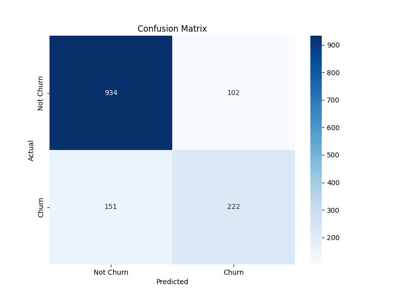

# Predictive Modeling for Customer Churn in the Telecom Industry

## Executive Summary

This repository documents the development and evaluation of a machine learning model designed to predict customer churn for a telecom services provider. By leveraging a logistic regression classifier, this project moves beyond historical analysis to provide a forward-looking tool capable of identifying at-risk customers with **82% accuracy**. The primary objective is to enable proactive customer retention strategies, thereby minimizing revenue loss and enhancing customer lifetime value.

The entire workflow, from data ingestion and rigorous preprocessing to model training and performance validation, is detailed herein, demonstrating a disciplined, end-to-end machine learning lifecycle.

---

## Business Imperative

In the highly competitive telecom sector, customer retention is a primary driver of profitability. Proactively identifying customers who are likely to churn allows the business to strategically deploy retention incentives, such as targeted promotions or service upgrades. This model serves as the analytical engine to power such a data-driven retention program.

---

## Data Science Methodology

The project was executed following a structured machine learning methodology:

### 1. Data Ingestion & Preprocessing

The raw dataset, comprising over 7,000 customer records, was subjected to a rigorous preprocessing pipeline to prepare it for modeling:
*   **Data Integrity Validation:** Initial analysis confirmed the dataset's high quality, with only minor data type inconsistencies in the `TotalCharges` field, which were programmatically corrected.
*   **Feature Engineering (One-Hot Encoding):** All categorical features (e.g., `Contract`, `InternetService`) were transformed into a numerical format using one-hot encoding (`pd.get_dummies`). The `drop_first=True` parameter was employed to prevent multicollinearity and create a more efficient feature set.
*   **Target Variable Transformation:** The boolean `Churn` variable was encoded into a binary format (1 for 'Yes', 0 for 'No').
*   **Feature Scaling:** To ensure the model's convergence and prevent features with large magnitudes from dominating the learning process, all predictors were standardized using Scikit-learn's `StandardScaler`.

### 2. Model Development & Training

*   **Algorithm Selection:** **Logistic Regression** was chosen as the baseline model due to its high interpretability and robust performance in binary classification tasks.
*   **Data Partitioning:** The dataset was partitioned into an 80% training set and a 20% hold-out test set using `train_test_split` to ensure an unbiased evaluation of the model's performance on unseen data.
*   **Model Training:** The classifier was trained on the scaled training data, learning the complex relationships between customer attributes and churn behavior.

---

## Performance Evaluation & Business Value

The model's performance was validated against the unseen test set, yielding an overall **accuracy of 82.04%**.

### Confusion Matrix Analysis

The confusion matrix provides a granular view of the model's predictive power:

*   **True Negatives (934):** Correctly identified customers who would not churn.
*   **True Positives (222):** Correctly identified customers who *would* churn. **This is the primary value-driver for a retention campaign.**
*   **False Positives (102):** Incorrectly flagged loyal customers as churn risks. (Low cost to business - an unnecessary discount might be offered).
*   **False Negatives (151):** Failed to identify customers who would churn. **This represents lost opportunity and is the key metric to minimize.**

### Key Performance Metrics

The classification report provides further insight:

| Metric | Churn (1) | Interpretation |
| :--- | :---: | :--- |
| **Precision** | 0.69 | When the model predicts a customer will churn, it is correct 69% of the time. |
| **Recall** | 0.60 | The model successfully identifies 60% of all customers who *actually* churned. |
| **F1-Score**| 0.64 | The harmonic mean of Precision and Recall, providing a balanced measure of performance. |

### Conclusion & Next Steps

This Logistic Regression model serves as a strong and highly valuable baseline. With a **Recall of 60%**, it can successfully flag a majority of at-risk customers, allowing the business to capture millions in potentially lost revenue.

Future iterations could explore more complex models (e.g., Random Forest, Gradient Boosting) and advanced feature engineering to further improve the Recall rate, minimizing lost opportunities and maximizing the ROI of retention campaigns.

---

## Technical Stack

*   **Python 3**
*   **Pandas:** For data ingestion, manipulation, and preprocessing.
*   **Scikit-learn:** For model development, training, and evaluation.
*   **Matplotlib & Seaborn:** For data visualization and model performance reporting.
